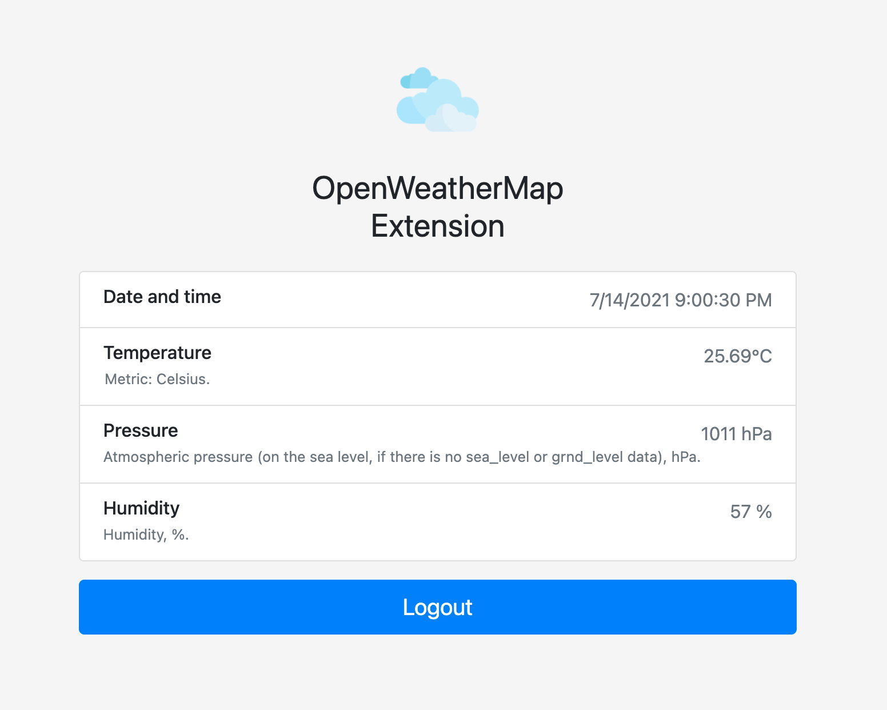

[![Contributors][contributors-shield]][contributors-url]
[![Forks][forks-shield]][forks-url]
[![Stargazers][stars-shield]][stars-url]
[![Issues][issues-shield]][issues-url]
[![MIT License][license-shield]][license-url]
[![LinkedIn][linkedin-shield]][linkedin-url]

<br />
<p align="center">
  <a href="https://github.com/luisitoguanes/chrome-extensions">
    
  </a>

  <h3 align="center">Open Weather Chrome Extension</h3>

  <p align="center">
    This is a test project to create a chrome extension, implementing a call to OpenWeather.org API.
    <br />
    <a href="https://github.com/luisitoguanes/chrome-extensions"><strong>Explore the docs »</strong></a>
    <br />
    <br />
    <a href="https://github.com/luisitoguanes/chrome-extensions/issues">Report Bug</a>
    ·
    <a href="https://github.com/luisitoguanes/chrome-extensions/issues">Request Feature</a>
  </p>
</p>


<!-- TABLE OF CONTENTS -->
<details open="open">
  <summary><h2 style="display: inline-block">Table of Contents</h2></summary>
  <ol>
    <li>
      <a href="#about-the-project">About The Project</a>
      <ul>
        <li><a href="#built-with">Built With</a></li>
      </ul>
    </li>
    <li>
      <a href="#getting-started">Getting Started</a>
      <ul>
        <li><a href="#installation">Installation</a></li>
      </ul>
    </li>
    <li><a href="#usage">Usage</a></li>
    <li><a href="#roadmap">Roadmap</a></li>
    <li><a href="#license">License</a></li>
    <li><a href="#contact">Contact</a></li>
  </ol>
</details>


<!-- ABOUT THE PROJECT -->
## About The Project



The only thing this extension does right now is to change the default newTab page with weather information. You have to first get a API Key from openWeatherMap.org (it's free for some things).

The extension is configured to show Asunción Paraguay weather, but you can change this by changing the URL in scrips.js file.

### Built With
* [OpenWeatherMap](https://openweathermap.org/)
* [Bootstrap](https://getbootstrap.com/)
* [Luke Haas CSS Loading Spinners](https://projects.lukehaas.me/css-loaders/)


<!-- GETTING STARTED -->
## Getting Started

To get a local copy up and running follow these simple steps.
### Installation

1. Clone the repo
   ```sh
   git clone https://github.com/luisitoguanes/chrome-extensions.git
   ```
2. Enable developer mode on Chrome
3. Clic on "Load unpacked" on the Chrome extensions config page
   ```sh
   chrome://extensions/
   ```


<!-- USAGE EXAMPLES -->
## Usage

Use this space to show useful examples of how a project can be used. Additional screenshots, code examples and demos work well in this space. You may also link to more resources.


<!-- ROADMAP -->
## Roadmap

See the [open issues](https://github.com/luisitoguanes/chrome-extensions/issues) for a list of proposed features (and known issues).


<!-- LICENSE -->
## License

Distributed under the MIT License. See `LICENSE` for more information.


<!-- CONTACT -->
## Contact

Luis Guanes - [@luisitoguanes](https://twitter.com/luisitoguanes) - luis.guanes10@gmail.com

Project Link: [https://github.com/luisitoguanes/chrome-extensions](https://github.com/luisitoguanes/chrome-extensions)

<!-- MARKDOWN LINKS & IMAGES -->
<!-- https://www.markdownguide.org/basic-syntax/#reference-style-links -->
[contributors-shield]: https://img.shields.io/github/contributors/luisitoguanes/chrome-extensions.svg?style=for-the-badge
[contributors-url]: https://github.com/luisitoguanes/chrome-extensions/graphs/contributors
[forks-shield]: https://img.shields.io/github/forks/luisitoguanes/chrome-extensions.svg?style=for-the-badge
[forks-url]: https://github.com/luisitoguanes/chrome-extensions/network/members
[stars-shield]: https://img.shields.io/github/stars/luisitoguanes/chrome-extensions.svg?style=for-the-badge
[stars-url]: https://github.com/luisitoguanes/chrome-extensions/stargazers
[issues-shield]: https://img.shields.io/github/issues/luisitoguanes/chrome-extensions.svg?style=for-the-badge
[issues-url]: https://github.com/luisitoguanes/chrome-extensions/issues
[license-shield]: https://img.shields.io/github/license/luisitoguanes/chrome-extensions.svg?style=for-the-badge
[license-url]: https://github.com/luisitoguanes/chrome-extensions/blob/master/LICENSE.txt
[linkedin-shield]: https://img.shields.io/badge/-LinkedIn-black.svg?style=for-the-badge&logo=linkedin&colorB=555
[linkedin-url]: https://www.linkedin.com/in/luis-guanes-73a11160/
